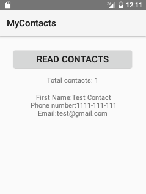
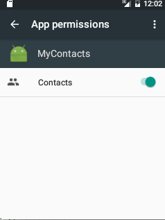
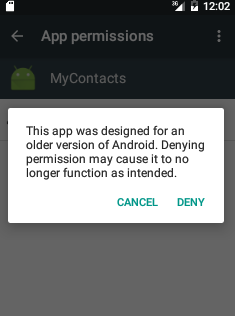
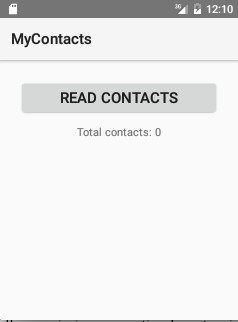

# Android M Permissions and Forward Compatibility for Legacy Apps

Android ‘M‘ Permissions and Forward Compatibility 

### Introduction

Material design is a new system for visual, interaction and motion design. We
originally launched the [Topeka web app](https://github.com/Polymer/topeka)
as an Open Source example of material design on the web.

The Android version of Topeka demonstrates that the same branding and material
design principles can be used to create a consistent experience across
platforms. You can read more about it on the
[Android Developers
blog](http://android-developers.blogspot.co.uk/2015/06/more-material-design-with-topeka-for_16.html).

### Screenshots






### Getting Started

Clone this repository, enter the top level directory and run <code>./gradlew tasks</code> to get an overview of all the tasks available for this project.

Some important tasks are:

```
assembleDebug - Assembles all Debug builds.
installDebug - Installs the Debug build.
```

### Download Android M Developer Preview
To test revoking app permissions at runtime, you will need Android M Developer preview SDK Manager. You can download preview SDK from the following link
http://developer.android.com/preview/index.html      

### Support

If you've found an error in this sample, please file an issue:

https://github.com/kunal-jaggi/android-m-permissions-forward/issues
